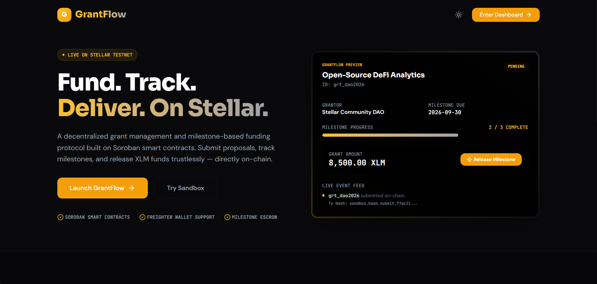
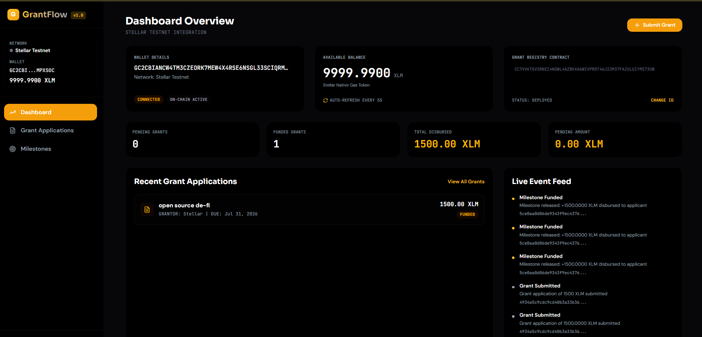
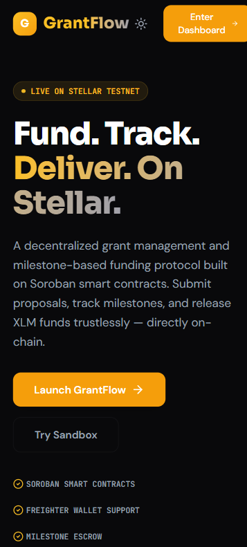
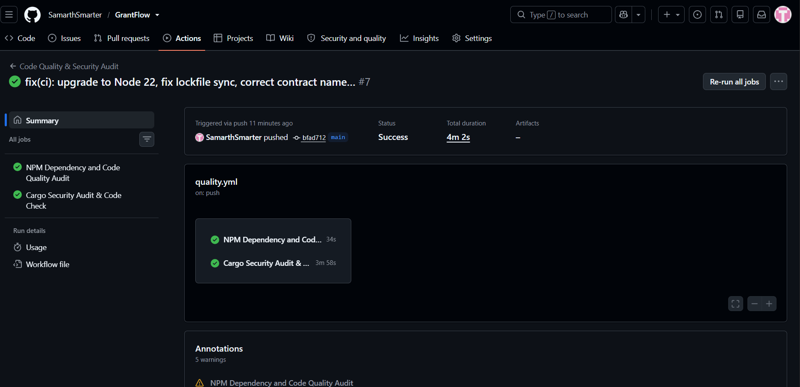

# GrantFlow: Fund. Track. Deliver. On Stellar.

<div align="center">
  
</div>

<div align="center">
  <h3>Decentralized Grant Management & Milestone Escrow Protocol on Soroban</h3>
  <p>A Web3 grant funding and milestone verification protocol providing zero-trust application tracking, immutable record verification, and atomic contract-to-contract settlements on the Stellar Network.</p>
</div>

<div align="center">
  
[](https://stellar.org)
[](https://stellar.org/developers)
[](https://react.dev)
[](https://www.typescriptlang.org)
[](https://vite.dev)
[](LICENSE)

</div>

---

## 🔗 Links & Demo
- **Live Deployment**: [grantflow-stellar.netlify.app](https://grantflow-stellar.netlify.app/)
- **Video Demo**: [Watch on Google Drive](https://drive.google.com/file/d/1BPdLxAAMljsIEpeTDBp3-8TLdnyG-HFe/view?usp=sharing)

## 📸 Gallery

### Desktop Interface




### Mobile Interface


### Automated CI/CD Pipeline


---

## What is GrantFlow?

**GrantFlow** is a decentralized, non-custodial grant registry and milestone escrow system built on top of the Stellar Network and powered by Soroban smart contracts. It bridges DAO treasury workflows with cryptographic milestone networks, allowing developers, creators, and protocols to deploy on-chain grant applications, receive native token funding via atomic contracts, and track deliverables trustlessly.

Traditional grant funding is broken. Standard grant programs rely on manual, centralized registries (Google Forms, Notion, or centralized web portals) that are decoupled from actual treasury settlement rails. GrantFlow was built to resolve this disconnection, bundling the application record, the milestone conditions, and the payment mechanism into a single, cohesive, smart-contract-backed ledger state.

### Key Capabilities

*   **Immutable Grant Registries**: Applications are recorded directly onto the Stellar ledger via Soroban.
*   **Trustless Milestone Verification**: Organizations can securely release funds only upon verifiable milestone completion.
*   **Atomic Contract-to-Contract Escrow**: A dual-contract architecture ensures that a grant's status is only updated when the token transfer actually succeeds.
*   **Developer-Friendly UX**: Clean, emerald-themed glassmorphic UI built with React 19 and Tailwind CSS patterns.
*   **Zero-Config Sandbox Mode**: Test the entire end-to-end lifecycle locally without needing real XLM or a browser extension wallet.

---

## Dual-Mode Experience

To allow judges, developers, and users to test the full lifecycle, GrantFlow features a **dual-mode gateway**:

### 1. Sandbox Mode (Default)
Experience the full power of GrantFlow immediately with zero setup.
*   **No Wallet Required**: Uses a mocked internal keypair.
*   **Pre-funded**: Simulated balance of 12,000 test XLM.
*   **Live Mock Data**: Pre-populated with 4 realistic grant scenarios (Pending, Funded, and Rejected states).
*   **Instant Tx Simulation**: Contract interactions resolve instantly in the UI with realistic toast notifications.

### 2. Stellar Testnet Mode
Interact with real Soroban smart contracts deployed on the Stellar Testnet.
*   Requires the [Freighter Browser Extension](https://freighter.app/).
*   Interact with live XLM tokens and actual on-chain ledger state.
*   Uses `@creit.tech/stellar-wallets-kit` for standard wallet connections.

**To switch to Testnet:**
1. Install Freighter and create a wallet.
2. Ensure Freighter is set to the **Testnet** network in its settings.
3. Toggle the network selector in the GrantFlow header to `Testnet`.
4. Click `Connect Wallet`.

---

## Smart Contract Architecture

GrantFlow addresses the broken grant lifecycle by introducing a dual-contract on-chain architecture:

1.  **`GrantRegistry`**: The immutable ledger of record. Stores application details (applicant, grantor, amount, proposal, deadline, status).
2.  **`MilestoneEscrow`**: The execution engine. Handles the authorization and routing of XLM, transferring funds via the Stellar Asset Contract, and communicating back to the registry.

**Atomic Flow:**
```text
  GrantFlow:      [On-Chain Grant] =====(Atomic Escrow Release)=====> [Auto-Settled Registry]
                       |                                                   ^
                       |                                                   |
                       v                                                   |
                [MilestoneEscrow] ---------(Stellar Native XLM)------------+
```

---

## Local Development Guide

### Prerequisites
*   Node.js v20+
*   npm v10+
*   Rust (for smart contract compilation)
*   Stellar CLI (`stellar-cli`)

### Running the Frontend

```bash
# Clone the repository
git clone https://github.com/your-org/GrantFlow.git
cd GrantFlow

# Install dependencies
npm install

# Start the Vite development server
npm run dev
```

The application will be available at `http://localhost:5173`.

### Running Tests
```bash
# Run the frontend Vitest suite
npm run test
```

---

## Smart Contract Deployment (Testnet)

To deploy your own instances of the GrantFlow smart contracts to the Stellar Testnet, follow these steps:

### 1. Build the Contracts
```bash
# Compile both Soroban contracts to WebAssembly
cargo build --target wasm32-unknown-unknown --release
```

### 2. Generate and Fund a Deployer Account
```bash
stellar keys generate grantflow-deployer --network testnet
stellar keys address grantflow-deployer

# Copy the address and fund it using Friendbot
curl "https://friendbot.stellar.org/?addr=<DEPLOYER_ADDRESS>"
```

### 3. Deploy the Grant Registry
```bash
stellar contract deploy \
  --wasm target/wasm32-unknown-unknown/release/grant_registry.wasm \
  --source grantflow-deployer \
  --network testnet
```
*Take note of the returned `GRANT_REGISTRY_CONTRACT_ID`.*

### 4. Deploy the Milestone Escrow
```bash
stellar contract deploy \
  --wasm target/wasm32-unknown-unknown/release/milestone_escrow.wasm \
  --source grantflow-deployer \
  --network testnet
```
*Take note of the returned `MILESTONE_ESCROW_CONTRACT_ID`.*

### 5. Initialize the Contracts
Initialize the Grant Registry:
```bash
stellar contract invoke \
  --id <GRANT_REGISTRY_CONTRACT_ID> \
  --source grantflow-deployer \
  --network testnet \
  -- initialize \
  --admin <DEPLOYER_ADDRESS> \
  --milestone_escrow <MILESTONE_ESCROW_CONTRACT_ID>
```

Initialize the Milestone Escrow (requires the native XLM token ID):
```bash
stellar contract invoke \
  --id <MILESTONE_ESCROW_CONTRACT_ID> \
  --source grantflow-deployer \
  --network testnet \
  -- initialize \
  --admin <DEPLOYER_ADDRESS> \
  --token CDLZFC3SYJYDZT7K67VZ75HPJVIEUVNIXF47ZG2FB2RMQQVU2HHGCYSC \
  --registry <GRANT_REGISTRY_CONTRACT_ID>
```

### 6. Update Frontend Configuration
Open `src/services/network.ts` and update the default contract IDs:
```typescript
const DEFAULT_TESTNET_REGISTRY_ID = 'CC7VVKTGVSRNEZ4NGWL4AZBKXA6WIVPROT46J23M37FAZULUIYMS73UW';
const DEFAULT_TESTNET_MILESTONE_ESCROW_ID = 'CASSS3Q2B74AML2I2GWGLOA43IGP3XVFMCVP3MRSKPZK2C5SRODTWCWY';
```

---

## License

This project is licensed under the MIT License - see the [LICENSE](LICENSE) file for details.
