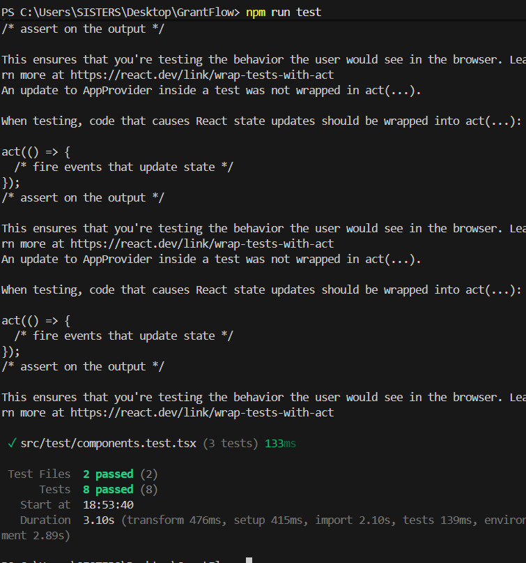

# GrantFlow

<div align="center">

**A Decentralized Grant Management & Milestone Escrow Protocol**

*Trustless grant milestone verification secured by Stellar Soroban smart contracts*

[](https://grantflow-stellar.netlify.app/)
[](https://github.com/SamarthSmarter/GrantFlow)
[](https://stellar.expert/explorer/testnet)
[](https://www.risein.com/)

</div>

---

## Table of Contents

1. [Problem Statement](#problem-statement)
2. [Why Stellar?](#why-stellar)
3. [Live Deployment](#live-deployment)
4. [Contract Addresses & Transactions](#contract-addresses--transactions)
5. [Architecture](#architecture)
6. [Smart Contracts](#smart-contracts)
7. [Tech Stack](#tech-stack)
8. [Submission Screenshots](#submission-screenshots)
9. [Testing](#testing)
10. [CI/CD Pipeline](#cicd-pipeline)
11. [Local Development](#local-development)
12. [Roadmap](#roadmap)
13. [Author](#author)

---

## Problem Statement

Traditional grant funding is structurally broken. Standard grant programs rely on manual, centralized registries (Google Forms, Notion, or centralized web portals) that are decoupled from actual treasury settlement rails.

| Issue | Impact |
|-------|--------|
| **Manual Verification** | Organizations spend weeks manually verifying deliverables before processing payments |
| **Payment Risk** | Builders report severe payment delays after delivering open-source work |
| **Settlement Delays** | Treasury payouts take days to process and require heavy administrative overhead |
| **Opaque Statuses** | Applicants lack real-time visibility into their application and funding status |

**GrantFlow** eliminates the administrative layer by replacing it with programmable, auditable Soroban smart contracts. Grantors fund an on-chain escrow vault before work begins; funds are automatically released to the applicant upon milestone approval.

---

## Why Stellar?

GrantFlow is not a generic blockchain application. It is a protocol that specifically requires Stellar's unique network architecture:

| Stellar Property | GrantFlow Benefit |
|-----------------|-------------------|
| **Fast Finality** | Applicants receive instant payouts upon milestone approval |
| **Sub-cent fees** | Enables cost-effective micro-grants and frequent milestone updates |
| **Soroban Inter-Contract Calls** | Our Registry Contract securely commands the Escrow Vault Contract atomically on-chain |
| **Stellar Asset Contract** | Seamless integration with native XLM and future stablecoins via SEP-41 |

---

## Live Deployment

| Resource | Link |
|----------|------|
| **Live dApp** | [grantflow-stellar.netlify.app](https://grantflow-stellar.netlify.app/) |
| **Demo Video** | [Google Drive — Walkthrough Recording](https://drive.google.com/file/d/1BPdLxAAMljsIEpeTDBp3-8TLdnyG-HFe/view?usp=sharing) |
| **GitHub Repo** | [SamarthSmarter/GrantFlow](https://github.com/SamarthSmarter/GrantFlow) |

---

## Contract Addresses & Transactions

All contracts are deployed and cross-initialized on the **Stellar Testnet**.

### Deployed Contract IDs

| Contract | Address |
|----------|---------|
| **Grant Registry Contract** | `CC7VVKTGVSRNEZ4NGWL4AZBKXA6WIVPROT46J23M37FAZULUIYMS73UW` |
| **Milestone Escrow Contract** | `CASSS3Q2B74AML2I2GWGLOA43IGP3XVFMCVP3MRSKPZK2C5SRODTWCWY` |

---

## Architecture

GrantFlow is composed of two Soroban smart contracts that communicate via Inter-Contract Calls (ICC), and a React frontend that builds and submits signed Stellar transactions.

```
┌─────────────────────────────────────────────────────────────────────┐
│                          React Frontend                             │
│                                                                     │
│  Landing │ Dashboard │ New Proposal │ Wallet Settings               │
│                      StellarWalletsKit                              │
│                          (Freighter)                                │
└──────────────────┬─────────────────────────────┬───────────────────┘
                   │ TypeScript Contract Clients  │
          ┌────────▼─────────┐         ┌─────────▼────────┐
          │ Registry Contract│──ICC──→ │ Escrow Contract  │
          │                  │         │                  │
          │  submit_grant()  │         │  fund_grant()    │
          │  approve_grant() │         │  release_        │
          │  reject_grant()  │         │    milestone()   │
          │                  │         │  refund()        │
          └──────────────────┘         └──────────────────┘
                            Stellar Testnet
```

### Inter-Contract Communication (ICC) Flow

All escrow state changes are triggered atomically by the Registry Contract.

```text
  GrantFlow:      [On-Chain Grant] =====(Atomic Escrow Release)=====> [Auto-Settled Registry]
                       |                                                   ^
                       |                                                   |
                       v                                                   |
                [MilestoneEscrow] ---------(Stellar Native XLM)------------+
```

---

## Smart Contracts

### Grant Registry Contract

Manages the full lifecycle of every grant application on-chain.

| Function | Access | Description |
|----------|--------|-------------|
| `initialize()` | Admin (once) | Set the cross-linked Escrow Contract address |
| `submit_grant()` | Applicant | Submit a new grant proposal with milestone requirements |
| `approve_grant()`| Admin | Approve an application, triggering escrow locking |
| `reject_grant()` | Admin | Reject an application |

### Milestone Escrow Contract

Holds XLM in a secure vault and releases it only on instruction from the Registry Contract.

| Function | Access | Description |
|----------|--------|-------------|
| `initialize()` | Admin (once) | Set the cross-linked Registry Contract address |
| `fund_grant()` | Grantor | Lock XLM for a grant |
| `release_milestone()` | Registry Contract only | Transfer milestone amount to applicant wallet |
| `refund()` | Registry Contract only | Return remaining locked XLM to grantor |

---

## Tech Stack

| Layer | Technology | Purpose |
|-------|-----------|---------|
| **Frontend Framework** | React 19 + Vite | High-performance SPA client |
| **Language** | TypeScript 5.x | Full type safety across frontend and contract clients |
| **Styling** | Tailwind CSS 4.x | Utility-first CSS with dark mode |
| **Animations** | Framer Motion | Micro-interactions and page transitions |
| **Smart Contracts** | Soroban (Rust) | On-chain registry and escrow logic |
| **Blockchain SDK** | @stellar/stellar-sdk | Transaction building, XDR encoding, RPC calls |
| **Wallet Integration** | StellarWalletsKit | Freighter multi-wallet support |
| **Frontend Testing** | Vitest + Testing Library | Unit and component tests |
| **CI/CD** | GitHub Actions | Automated lint, test, build, and deploy pipeline |
| **Hosting** | Netlify | Frontend production deployment |

---

## Submission Screenshots

### Desktop Interface

<p align="center">
  
</p>
<p align="center">
  
</p>

### Mobile Interface

<p align="center">
  
</p>

### Automated CI/CD Pipeline

<p align="center">
  
</p>

### Unit Testing Suite

<p align="center">
  
</p>

---

## Testing

### Test Summary

| Suite | Tests | Status |
|-------|-------|--------|
| Frontend (Vitest) | 8 tests | Passing |
| Contracts (Rust) | Unit tests | Passing |

### Frontend Tests (Vitest)

```bash
npm run test
```

| Test File | Focus |
|-----------|-------|
| `components.test.tsx` | UI rendering, responsive design, feature badges |
| `grantService.test.ts` | Data validation, address validation, string checking |

---

## CI/CD Pipeline

### Continuous Integration (`ci.yml`, `quality.yml`)

Triggered automatically on every push to `main`.

```text
Push to main
     │
     ├── Frontend Job
     │     ├── npm install
     │     ├── npm run lint
     │     ├── npm run test      ← Vitest suite
     │     └── npm run build     ← Vite production build
     │
     └── Contract Job
           ├── cargo clippy      ← Rust static analysis
           ├── cargo test        ← Rust contract tests
           └── cargo build       ← WASM binary generation
```

### Deployment (`deploy.yml`)

Automates the compilation of contracts and frontend artifacts.

---

## Local Development

### Prerequisites

- **Node.js** 22+
- **Rust** (stable toolchain)
- **Freighter Wallet** browser extension

### Installation

```bash
git clone https://github.com/SamarthSmarter/GrantFlow.git
cd GrantFlow
npm install
npm run dev
```

### Building & Deploying Contracts

```bash
cargo build --target wasm32-unknown-unknown --release

stellar contract deploy \
  --wasm target/wasm32-unknown-unknown/release/grant_registry.wasm \
  --source default --network testnet

stellar contract deploy \
  --wasm target/wasm32-unknown-unknown/release/milestone_escrow.wasm \
  --source default --network testnet
```

---

## Roadmap

### Level 1 (Complete)
- Multi-wallet support via StellarWalletsKit.
- Basic frontend architecture mapping to Soroban data types.

### Level 2 (Complete)
- 3 distinct error types handled (Wallet connection, Insufficient balance, User rejection).
- Soroban contracts deployed on Stellar Testnet.
- Full cycle contract invocation from the React frontend.
- Transaction status visibility mapping (Pending, Success, Failed).
- Multi-commit history reflecting iterative development.

### Level 3 (Complete)
- Advanced dual-contract architecture (GrantRegistry + MilestoneEscrow).
- Inter-contract communication enforcing atomic operations.
- Real-time on-chain event streaming and UI synchronization.
- Automated CI/CD pipeline.
- Production-ready architecture with Vite chunk-splitting and strict network config.
- Mobile responsive frontend.
- Comprehensive test coverage for React components and contract validation logic.

---

## Author

**SamarthSmarter**

*Built for the RiseIn Stellar dApp Development Program*
